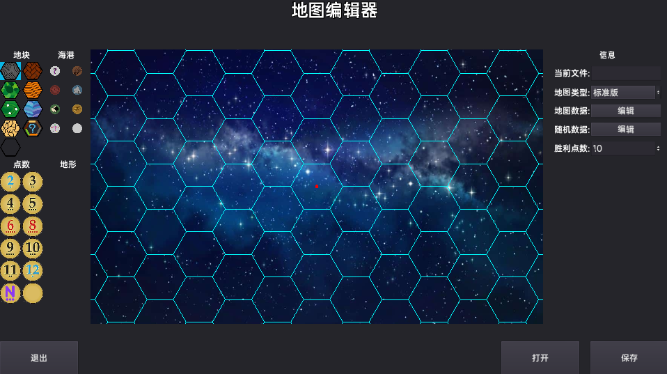
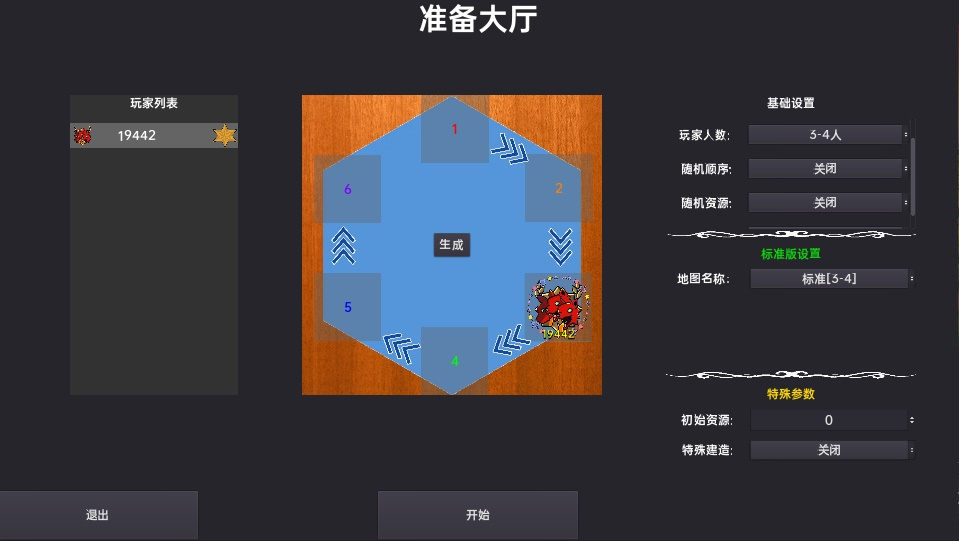

# Catan

- [Catan](#catan)
  - [About](#about)
  - [Features](#features)
  - [Shortcut](#shortcut)
  - [Notice](#notice)
  - [Screenshot](#screenshot)

## About

本项目旨在实现一个可以进行局域网联机的[《卡坦岛》](https://baike.baidu.com/item/%E5%8D%A1%E5%9D%A6%E5%B2%9B/3203413?fr=aladdin)

## Features

* 支持最多6人的局域网联机
* 支持断线重连
* 全自动化, 玩家只需要做必要的决策
* 内置地图编辑器, 可以自由定义卡坦地图
  * 支持各种参数随机化配置, 比如点数, 地块类型, 海港
  * 支持配置可用资源上限, 建筑上限, 卡牌类型

## Shortcut
* 鼠标右键按住移动: 移动地图
* 鼠标滚轮: 调整地图缩放
## Notice
* 游戏采用玩家名作为唯一id, 一局游戏内的所有玩家**不能重名**

## Screenshot
***
主界面:

***
编辑器:

***
准备界面:

***
游戏中:
